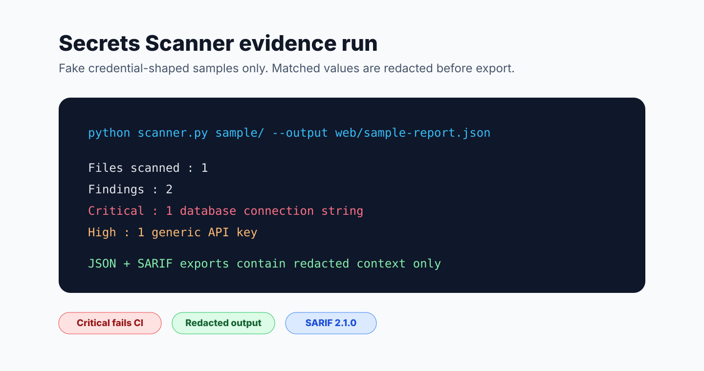

# Secrets Scanner

[](https://github.com/omobolajiadeyan/secrets-scanner/actions/workflows/tests.yml)
[](LICENSE)
[](https://github.com/omobolajiadeyan)

A lightweight Python security tool that detects exposed API keys, passwords,
tokens, private keys, and connection strings before they reach production or a
public repository.

Built and maintained by [Omobolaji Adeyan](https://github.com/omobolajiadeyan)
as part of a practical security-engineering toolkit.

## Why This Matters

Exposed secrets are a common source of security incidents. This scanner helps
developers catch obvious credential leaks locally, in pull requests, and in
GitHub Code Scanning workflows.

## Features

- Detects AWS keys, GitHub tokens, Stripe keys, private keys, database URLs,
  JWTs, generic passwords, and more
- Redacts matched values in terminal, JSON, and SARIF output
- Exports JSON for automation and SARIF 2.1.0 for GitHub Code Scanning
- Ships as a reusable GitHub Action
- Includes a browser report viewer for redacted JSON evidence
- Uses only the Python standard library
- Returns exit code `2` when critical findings are found

## Project Evidence

The sample evidence run scans a public-safe fixture containing fake
credential-shaped strings, redacts matched values, and produces reviewable JSON
and SARIF output.



See [Project Evidence](docs/PROJECT_EVIDENCE.md) for exact commands, expected
sample counts, redaction boundaries, and output safety notes. External
reviewers can use the [Evaluator Guide](docs/EVALUATOR_GUIDE.md) for a
five-minute review.

## Supported Secret Types

| Secret Type | Severity |
|---|---|
| AWS Access Key ID | CRITICAL |
| AWS Secret Access Key | CRITICAL |
| GitHub Token | CRITICAL |
| Slack Token | CRITICAL |
| Stripe Secret Key | CRITICAL |
| Private Key Block | CRITICAL |
| Database Connection String | CRITICAL |
| Generic API Key | HIGH |
| Generic Secret | HIGH |
| Google API Key | HIGH |
| SendGrid API Key | HIGH |
| Discord Bot Token | HIGH |
| Basic Auth in URL | HIGH |
| Twilio Account SID | HIGH |
| JWT Token | MEDIUM |

## Installation

```bash
git clone https://github.com/omobolajiadeyan/secrets-scanner.git
cd secrets-scanner
python --version
```

Python 3.10+ is recommended. No third-party packages are required.

## Local Usage

```bash
# Scan the current directory
python scanner.py .

# Scan a specific file or directory
python scanner.py /path/to/project

# Show redacted line context
python scanner.py . --verbose

# Only report HIGH and CRITICAL findings
python scanner.py . --severity HIGH

# Export JSON
python scanner.py . --output results.json

# Export SARIF for GitHub Code Scanning
python scanner.py . --format sarif --output secrets-scanner.sarif

# Run the bundled public-safe sample
python scanner.py sample/ --verbose
python scanner.py sample/ --output web/sample-report.json
```

## Browser Report Viewer

The `web/` folder provides a lightweight viewer for exported JSON reports. It
loads the checked-in `web/sample-report.json` by default and can load a fresh
export from the scanner.

```bash
python scanner.py sample/ --output web/sample-report.json
cd web
python3 -m http.server 8080
```

Open `http://127.0.0.1:8080/` to review severity counts, secret-type counts,
redacted findings, and file/line evidence.

## GitHub Action Usage

```yaml
name: Secrets Scanner

on:
  pull_request:
  push:
    branches: [main]

permissions:
  contents: read
  security-events: write

jobs:
  scan:
    runs-on: ubuntu-latest
    steps:
      - uses: actions/checkout@v4
      - uses: omobolajiadeyan/secrets-scanner@main
        with:
          path: .
          severity: HIGH
          output: secrets-scanner.sarif
      - uses: github/codeql-action/upload-sarif@v3
        if: always()
        with:
          sarif_file: secrets-scanner.sarif
```

## Output Safety

The scanner redacts matched values before printing or exporting results. SARIF
contains the finding type, severity, file path, line number, and redacted
context, but not the raw secret.

If you find a real secret in a repository, rotate it immediately. Removing it
from the latest commit is not enough because it may still exist in Git history.

## Project Structure

```text
secrets-scanner/
|-- action.yml
|-- scanner.py
|-- patterns.py
|-- docs/
|   |-- EVALUATOR_GUIDE.md
|   `-- PROJECT_EVIDENCE.md
|-- sample/
|   `-- example_bad.py
|-- tests/
|   `-- test_scanner.py
|-- web/
|   |-- index.html
|   |-- app.js
|   |-- style.css
|   `-- sample-report.json
`-- README.md
```

## Limits

This tool uses deterministic patterns and should be treated as a lightweight
guardrail, not a complete secret-management program. It may miss unusual
formats and may flag false positives. Use it alongside secret rotation,
least-privilege credentials, branch protection, code review, and platform-level
secret scanning.

## Part of the Security Automation Toolkit

Secrets Scanner is one piece of a practical security-automation toolkit. The others:

- **[PhishGuard AI](https://github.com/omobolajiadeyan/phishguard-ai)** — explainable offline phishing detection (flagship, on GitHub Marketplace)
- **[Log Analyzer](https://github.com/omobolajiadeyan/log-analyzer)** — MITRE ATT&CK-mapped log threat detection
- **[BehaviorSense](https://github.com/omobolajiadeyan/behaviorsense)** — UEBA-style behavioral anomaly detection
- **[CVE Dashboard](https://github.com/omobolajiadeyan/cve-dashboard)** — live NVD vulnerability intelligence
- **[VulnGPT](https://github.com/omobolajiadeyan/vulngpt)** — CVE-to-remediation triage assistant

Full portfolio: [github.com/omobolajiadeyan](https://github.com/omobolajiadeyan)

## Author

**Omobolaji Adeyan**  
Security Engineer and open-source security tooling maintainer  
[GitHub](https://github.com/omobolajiadeyan) | [Website](https://omobolajiadeyan.com)
